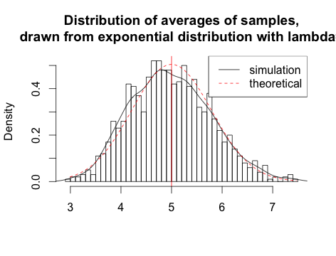
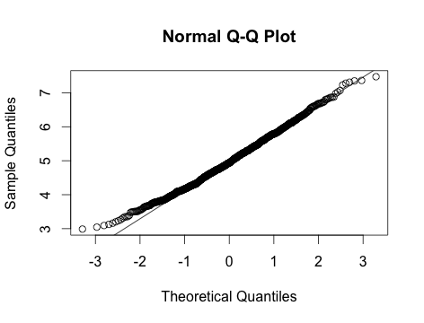
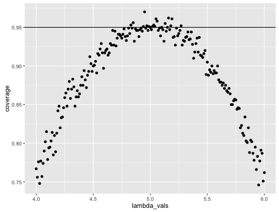

# Statistical Inference Course Project, Part 1: Simulation Exercises

## zthompson
## January 31, 2016
## Johns Hopkins - Coursera Statistical Inference


Our distribution can be simulated in R with `rexp(n, lambda)` where
`lambda` $\lambda$ is the rate parameter. The mean of our distibution is 
$1/\lambda$ and the standard deviation is also $1/\lambda$. During this project
we set $\lambda=0.2$ to help us understand the averages of 40 numbers sampled 
our distribution using $\lambda=0.2$.

To have some significance we will run our 40 number experiment, one-thousand times.


```r
set.seed(3)
lambda <- 0.2
num_sim <- 1000
sample_size <- 40
sim <- matrix(rexp(num_sim*sample_size, rate=lambda), num_sim, sample_size)
row_means <- rowMeans(sim)
```

To get our figure, let's use the code below:

```r
# plot the histogram of averages
hist(row_means, breaks=50, prob=TRUE,
     main="Distribution of averages of samples,
     drawn from exponential distribution with lambda=0.2",
     xlab="")
# density of the averages of samples
lines(density(row_means))
# theoretical center of distribution
abline(v=1/lambda, col="red")
# theoretical density of the averages of samples
xfit <- seq(min(row_means), max(row_means), length=100)
yfit <- dnorm(xfit, mean=1/lambda, sd=(1/lambda/sqrt(sample_size)))
lines(xfit, yfit, pch=22, col="red", lty=2)
# add legend
legend('topright', c("simulation", "theoretical"), lty=c(1,2), col=c("black", "red"))
```

 

The distribution of sample means is centered at 4.9866
while the theoretical center of the distribution is $\lambda^{-1}$ = 5.
Our variance of the sample mean is 0.6258 where the theoretical variance
of the distribution is $\sigma^2 / n = 1/(\lambda^2 n) = 1/(0.04 \times 40)$ =
0.625. Both our actual meaasns were very close to the theoretical!

the averages of samples follow normal distribution because of the central limit 
theorum. The figure above also shows the density computed using the histogram and the
normal density plotted with theoretical mean and variance values. Also, the
q-q plot below suggests the normality.


```r
qqnorm(row_means); qqline(row_means)
```

 

Let's evaluate the coverage of the confidence interval for
$1/\lambda = \bar{X} \pm 1.96 \frac{S}{\sqrt{n}}$


```r
lambda_vals <- seq(4, 6, by=0.01)
coverage <- sapply(lambda_vals, function(lamb) {
    mu_hats <- rowMeans(matrix(rexp(sample_size*num_sim, rate=0.2),
                               num_sim, sample_size))
    ll <- mu_hats - qnorm(0.975) * sqrt(1/lambda**2/sample_size)
    ul <- mu_hats + qnorm(0.975) * sqrt(1/lambda**2/sample_size)
    mean(ll < lamb & ul > lamb)
})

library(ggplot2)
qplot(lambda_vals, coverage) + geom_hline(yintercept=0.95)
```

 

The 95% confidence intervals for the rate parameter ($\lambda$) to be estimated
($\hat{\lambda}$) are
$\hat{\lambda}_{low} = \hat{\lambda}(1 - \frac{1.96}{\sqrt{n}})$ agnd
$\hat{\lambda}_{upp} = \hat{\lambda}(1 + \frac{1.96}{\sqrt{n}})$.
The selection of $\hat{\lambda}$ is around 5,
and the average of the sample mean falls within the confidence interval at least 95% of the time.
Note that the true rate, $\lambda$ is 5.


